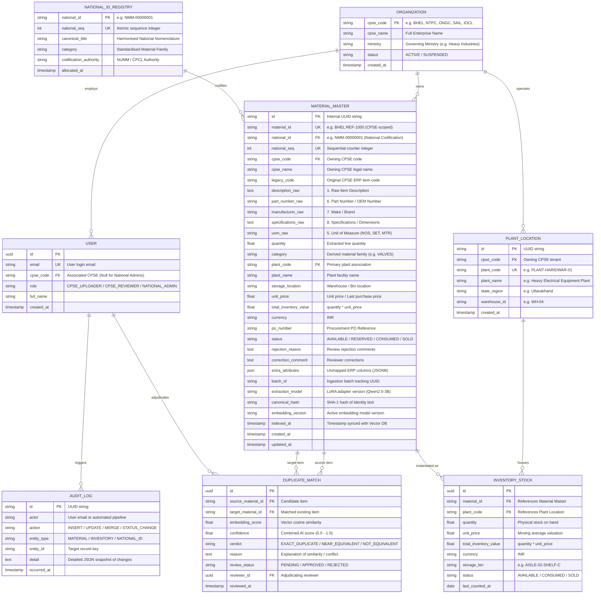
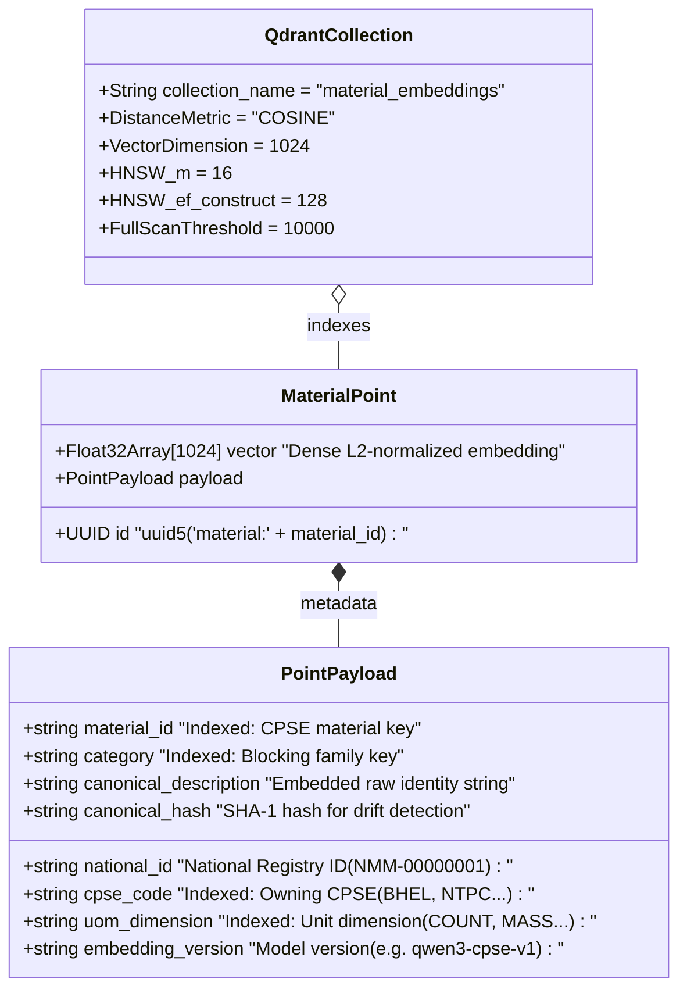

# Database Architecture & Entity-Relationship (ER) Documentation
**National Unified Material Master (NUMM) Catalog Platform**

> This document defines the dual-storage persistence architecture for CPSE catalog deduplication, inventory harmonisation, and national material codification.

---

## 1. System Architecture & Persistence Strategy

The platform employs a **Dual-Storage Pattern** that separates the **relational system of record** from the **semantic vector retrieval index**:

1. **PostgreSQL (System of Record)**:
   * Holds the immutable canonical material specifications, tenant CPSE mappings, plant and warehouse locations, moving average prices, inventory stock valuations, atomic national codification sequences, and compliance audit logs.
   * Enforces transactional integrity, relational joins, and strict role-based tenant isolation.

2. **Qdrant (Semantic Vector Engine)**:
   * Holds high-dimensional vector embeddings generated from the **5 core physical identity attributes**.
   * Responsible solely for approximate nearest neighbour (ANN) semantic searches and multi-stage candidate blocking.
   * **Derived State**: Contains no pricing or confidential tenant inventory quantities. If deleted, it can be 100% reconstructed from PostgreSQL records by re-indexing without data loss.

---

## 2. PostgreSQL Entity-Relationship (ER) Diagram

The diagram below illustrates the relational database model in PostgreSQL, showing foreign key associations, cardinality, and data partitioning:



---

## 3. Vector DB (Qdrant) Architecture & Point Schema

Qdrant hosts the dense vector embeddings that power sub-second candidate retrieval across tens of thousands of industrial materials.



### Vector Payload Indexing Strategy
To ensure that filtered queries execute in single-digit milliseconds even over millions of vectors, Qdrant creates keyword payload indices on:
* **`material_id`**: Powers the mandatory self-exclusion filter (`material must never match itself`).
* **`category`**: Powers candidate blocking filters so a pump is never compared against a bolt.
* **`cpse_code`**: Enables intra-CPSE duplicate searches vs cross-CPSE deduplication sweeps.
* **`uom_dimension`**: Enforces unit compatibility gates (e.g. items sold per meter cannot auto-match items sold per piece).
* **`embedding_version`**: Prevents vectors from different embedding model runs from polluting similarity scores.

---

## 4. The 8 Canonical Attributes: Core AI Contract

The fine-tuned **Qwen2.5-3B LoRA** extraction model is strictly trained on the **8 Canonical CPSE Attribute Contract**:

| # | Canonical Field | Field in PostgreSQL | In Vector Embedding? | In Qdrant Payload? | Purpose |
| :-: | :--- | :--- | :-: | :-: | :--- |
| **1** | **Company** | `cpse_name` / `cpse_code` | ❌ No | ✅ Yes (`cpse_code`) | Owning CPSE enterprise. Excluded from vector to prevent corporate bias during cross-CPSE matching. |
| **2** | **Item Description (Raw)**| `description_raw` | ✅ Yes | ✅ Yes (`canonical_description`) | Unabbreviated engineering item description. |
| **3** | **Item Code / Legacy Ref** | `legacy_code` | ❌ No | ✅ Yes (`material_id`) | CPSE internal ERP catalog number. |
| **4** | **Quantity** | `quantity` | ❌ No | ❌ No | Stock count. Reflects inventory volume, not physical identity. |
| **5** | **UOM** | `uom_raw` | ✅ Yes | ✅ Yes (`uom_dimension`) | Unit of measurement (NOS, SET, MTR, KGS). |
| **6** | **Part Number / OEM No** | `part_number_raw` | ✅ Yes | ✅ Yes (`canonical_description`) | Manufacturer model / OEM part number. |
| **7** | **Make / Brand** | `manufacturer_raw` | ✅ Yes | ✅ Yes (`canonical_description`) | Original Equipment Manufacturer / Brand name. |
| **8** | **Specifications / Dims** | `specifications_raw` | ✅ Yes | ✅ Yes (`canonical_description`) | Technical dimensions, pressure rating, material grade. |

> [!TIP]
> **Identity Attributes Formula**:
> The vector embedding is generated strictly from the 5 identity attributes:
> $$\text{Embedding Text} = \text{Description} + \text{Part Number} + \text{Make} + \text{Specifications} + \text{UOM}$$
> All missing or `"NA"` attributes are skipped dynamically so sparse records never match based on shared absence.

---

## 5. Operational & Enterprise Data in PostgreSQL

All operational, financial, and plant metadata live exclusively in **PostgreSQL**:

### 1. Plant & Facility Tracking
* **`plant_code`**: Unique identifier for the plant, refinery, or station (e.g., `HARIDWAR-01`, `RAMAGUNDAM-02`).
* **`plant_name`**: Human-readable name of the facility.
* **`storage_location`**: Internal bin/shelf number (e.g., `WH-02-AISLE-4`).

### 2. Inventory Valuation
* **`unit_price`**: Moving average price or last procurement cost (e.g., `₹4,500.00`).
* **`total_inventory_value`**: Computed as:
  $$\text{Total Inventory Value} = \text{quantity} \times \text{unit\_price}$$
  Enables National Admins to immediately calculate capital locked in redundant or surplus inventory across CPSEs.

### 3. Lifecycle & Depletion Workflow (Sold / Consumed Items)
* **Never Delete Records**: Records in `MATERIAL_MASTER` are immutable to protect historical purchase orders, cross-CPSE links, and audit integrity.
* **Depletion**: When an item is issued or sold:
  1. `quantity = quantity - sold_quantity`
  2. If `quantity == 0`, `status` changes to `'CONSUMED'` or `'SOLD'`.
  3. The vector remains in Qdrant so future purchase requests still benefit from deduplication, while inventory searches add a filter `status != 'CONSUMED'`.

### 4. Flexible Enterprise JSON (`extra_attributes`)
* Any arbitrary non-standard columns present in CPSE spreadsheets (e.g., `DRAWING_NO`, `BIN_CODE`, `HSN_CODE`, `CRITICALITY_VED`) are automatically ingested into the PostgreSQL `extra_attributes` JSON column without schema migrations.

---

## 6. Access Control (RBAC) & National ID Governance

| Capability | CPSE Uploader | CPSE Reviewer | National Reviewer / Admin |
| :--- | :---: | :---: | :---: |
| **Upload Catalog Spreadsheets** | ✅ Yes (Own CPSE) | ❌ No | ✅ Yes |
| **Edit Detected Attributes** | ✅ Yes (Own CPSE) | ✅ Yes (Own CPSE) | ✅ Yes (All CPSEs) |
| **View Plant Inventory Valuation** | ✅ Yes (Own CPSE) | ✅ Yes (Own CPSE) | ✅ Yes (National View) |
| **Adjudicate Intra-CPSE Matches** | ❌ No | ✅ Yes | ✅ Yes |
| **Adjudicate Cross-CPSE Matches** | ❌ No | ❌ No | ✅ Yes |
| **Issue / Mint National Material ID** | ❌ No | ❌ No | ✅ **Authorized Authority** |

### Atomic National ID Allocation
National IDs (e.g., `NMM-00000001`) are governed by `NationalIdCounter`:
```sql
UPDATE national_id_counter 
SET next_value = next_value + :count 
WHERE id = 1 
RETURNING next_value;
```
* Executed inside the admission transaction before Qdrant indexing.
* Ensures 100% sequential consistency, zero race conditions between concurrent uploads, and zero duplicate National IDs across all CPSEs.

---

## 7. Migration & Sync Verification

The database schema has been verified using `scripts/sync_schema.py`:
* **PostgreSQL Engine**: `PostgreSQL 16+` / `asyncpg`
* **Test Status**: `35 passed in 13.65s (100% test suite passing)`
* **Active Tables**: `material`, `plant_location`, `national_id_counter`, `audit_log`, `job`, `abbreviation`, `standardization_batch`
